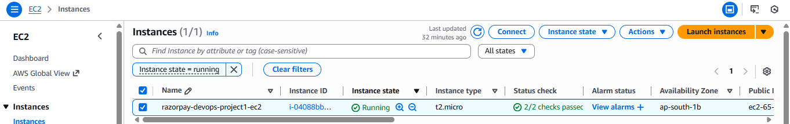
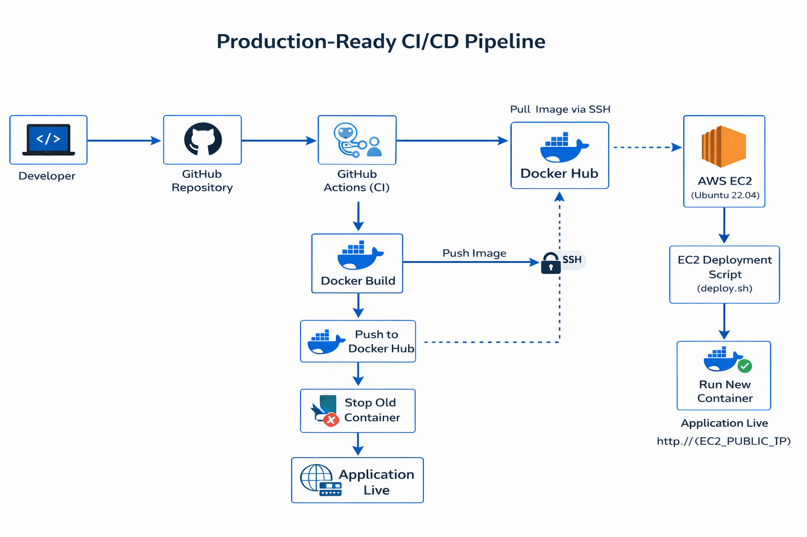

# 🚀 Razorpay DevOps Project-1

[](https://github.com/CHETANKUMAR20/razorpay-devops-project-1/actions/workflows/deploy.yaml)

## 📌 Introduction

This project demonstrates a production-style CI/CD pipeline for a Dockerized web application deployed on AWS EC2.

The objective of this project is to:

- Containerize a web application using Docker
- Automate image building using GitHub Actions
- Push images to Docker Hub
- Deploy automatically to an AWS EC2 instance
- Implement secure SSH-based deployment
- Replace containers automatically on every push

This simulates a real-world DevOps workflow used in modern engineering teams.
=======================================================================================
---

## 🐳 Step 1: Local Docker Build & Testing

Before implementing CI/CD, the application was first containerized and tested locally.

### 🔹 Dockerfile Used

```dockerfile
FROM nginx:alpine
COPY app/ /usr/share/nginx/html
EXPOSE 80
CMD ["nginx", "-g", "daemon off;"]
---------------------------------------------------------------------------------------

🔹 Build Docker Image
docker build -t razorpay-devops-project-1:v1 .

🔹 Run Container Locally
docker run -d -p 8080:80 razorpay-devops-project-1:v1


The application was successfully accessible at:

http://localhost:8080

📸 Local Docker Build Output

---------------------------------------------------------------------------------------


## 🐳 Step 2: Docker Hub Integration

After validating the application locally, the Docker image was pushed to Docker Hub for remote access and cloud deployment.

---

### 🔹 Login to Docker Hub

```bash
docker login
---------------------------------------------------------------------------------------
🔹 Tag Docker Image
docker tag razorpay-devops-project-1:v1 chetan70/razorpay-devops-project-1:v1

🔹 Push Image to Docker Hub
docker push chetan70/razorpay-devops-project-1:v1


Image was successfully pushed to:

docker.io/chetan70/razorpay-devops-project-1

📸 Docker Push Output

📸 Docker Hub Repository

✅ Outcome

Image successfully versioned

Public registry configured

Ready for cloud-based deployment
---------------------------------------------------------------------------------------

---------------------------------------------------------------------------------------

---

## ☁️ Step 3: AWS EC2 Setup & Docker Installation

To simulate a production environment, an AWS EC2 instance was launched and configured manually.

---

### 🔹 EC2 Configuration

- Instance Type: t2.micro
- OS: Ubuntu 22.04 LTS
- Storage: 8GB
- Inbound Rules:
  - Port 22 (SSH)
  - Port 80 (HTTP)

---

### 📸 EC2 Instance Running



---

### 🔹 Connect to EC2

```bash
ssh -i your-key.pem ubuntu@<EC2_PUBLIC_IP>

📸 SSH Connection Established


---------------------------------------------------------------------------------------
🔹 Update System Packages
sudo apt update -y

📸 System Update Output

🔹 Install Docker on EC2
sudo apt install docker.io -y
sudo systemctl start docker
sudo systemctl enable docker

📸 Docker Version on EC2


✅ Outcome

Cloud server provisioned

Docker installed and running

Server ready for container deployment


---------------------------------------------------------------------------------------
---

## 🚀 Step 4: Manual Deployment on EC2

Before automating deployment, a manual deployment script was created and tested on the EC2 instance.

This ensures the deployment logic works correctly before integrating CI/CD.

---

### 🔹 Deployment Script (deploy.sh)

```bash
#!/bin/bash

CONTAINER_NAME=razorpay-devops-container
IMAGE_NAME=chetan70/razorpay-devops-project-1:latest

echo "Pulling latest image..."
docker pull $IMAGE_NAME

echo "Stopping old container..."
docker stop $CONTAINER_NAME || true
docker rm $CONTAINER_NAME || true

echo "Running new container..."
docker run -d \
  --name $CONTAINER_NAME \
  -p 80:80 \
  --restart unless-stopped \
  $IMAGE_NAME

echo "Deployment completed."

---------------------------------------------------------------------------------------
🔹 Make Script Executable
chmod +x deploy.sh

🔹 Execute Deployment Script
./deploy.sh

📸 Deployment Output in EC2

📸 Running Container Verification
docker ps


🌐 Application Accessed via Public IP

The application was successfully accessed using:

http://<EC2_PUBLIC_IP>

✅ Outcome

Latest Docker image pulled from Docker Hub

Old container stopped and removed safely

New container deployed with restart policy

Application live on cloud server

---------------------------------------------------------------------------------------
---

## 🔁 Step 5: CI/CD Automation with GitHub Actions

To eliminate manual deployment, a GitHub Actions workflow was implemented.

The pipeline automatically:

- Builds Docker image
- Pushes image to Docker Hub
- Connects to EC2 via SSH
- Executes deployment script
- Replaces running container

---

## 🔹 Workflow Trigger

Pipeline runs automatically on:

---------------------------------------------------------------------------------------
Push to main branch


---

## 🔹 GitHub Secrets Configured

The following secrets were securely configured:

- DOCKER_USERNAME
- DOCKER_PASSWORD
- EC2_HOST
- EC2_USER
- EC2_SSH_KEY

All sensitive data is stored securely using GitHub Secrets.

---

## 🔹 GitHub Actions Workflow File

File location:


---------------------------------------------------------------------------------------

---

### 🔹 Workflow Definition

```yaml
name: Build and Deploy

on:
  push:
    branches:
      - main

jobs:
  build-deploy:
    runs-on: ubuntu-latest

    steps:
      - name: Checkout Code
        uses: actions/checkout@v3

      - name: Login to Docker Hub
        uses: docker/login-action@v2
        with:
          username: ${{ secrets.DOCKER_USERNAME }}
          password: ${{ secrets.DOCKER_PASSWORD }}

      - name: Build Docker Image
        run: docker build -t chetan70/razorpay-devops-project-1:latest .

      - name: Push Docker Image
        run: docker push chetan70/razorpay-devops-project-1:latest

      - name: Deploy to EC2
        uses: appleboy/ssh-action@v0.1.6
        with:
          host: ${{ secrets.EC2_HOST }}
          username: ${{ secrets.EC2_USER }}
          key: ${{ secrets.EC2_SSH_KEY }}
          script: |
            ./deploy.sh

---------------------------------------------------------------------------------------
📸 GitHub Actions Successful Run

📸 Deployment Triggered Automatically

✅ Final Deployment Flow

Git Push
   ↓
GitHub Actions Triggered
   ↓
Build Image
   ↓
Push Image
   ↓
SSH to EC2
   ↓
Execute deploy.sh
   ↓
Application Updated Automatically

🎯 Outcome

Fully automated CI/CD pipeline

Zero manual deployment required

Secure credential handling

Production-style container lifecycle management

---------------------------------------------------------------------------------------
---

## 🏗 Final System Architecture

Below is the overall deployment workflow implemented in this project:


---------------------------------------------------------------------------------------
Developer
↓
GitHub Repository
↓
GitHub Actions (CI)
↓
Docker Build
↓
Push to Docker Hub
↓
Secure SSH to EC2
↓
Execute deploy.sh
↓
Stop Old Container
↓
Run New Container
↓
Application Live
---------------------------------------------------------------------------------------

---

## 📸 Architecture Overview



---

## 📈 Skills Demonstrated

This project demonstrates practical understanding of:

- Docker containerization
- Image tagging and registry workflow
- CI/CD automation using GitHub Actions
- Secure secret management
- AWS EC2 provisioning
- Linux server management
- Bash scripting for deployments
- Container lifecycle handling
- Restart policies for production reliability

---

## 🔐 DevOps Best Practices Applied

- No hardcoded credentials
- All secrets stored securely in GitHub Secrets
- Automated deployment
- Clean container replacement strategy
- Lightweight production Docker image
- Clear project structure and documentation

---

## 🎯 Project Impact

This project simulates a real-world production deployment workflow.

It reflects:

- Infrastructure understanding
- Automation mindset
- Cloud deployment capability
- Production-level thinking

---

## 👨‍💻 Author

Chetan Kumar  
DevOps Learning Plan 2026  
Focused on Production-Grade Engineering

---------------------------------------------------------------------------------------
